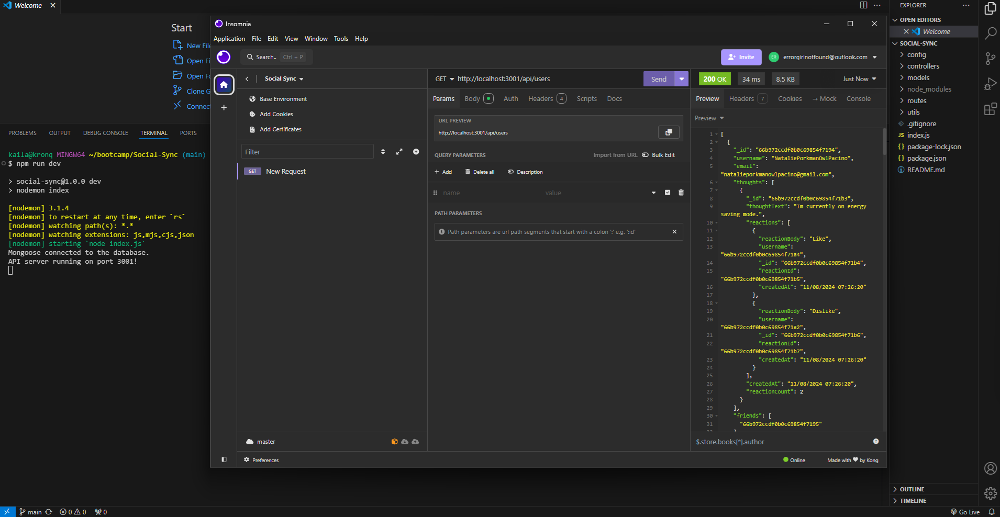
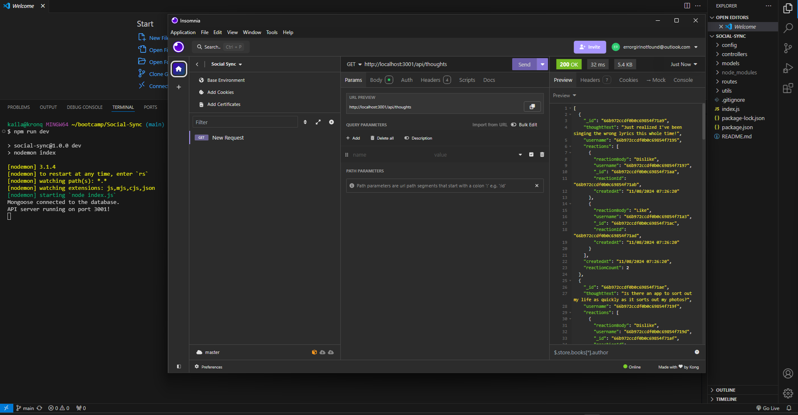

# Social-Sync

Social-Sync is the back end for your social network application! Built with Express.js, this API uses Mongoose to interact with a MongoDB database, making it ideal for handling large amounts of unstructured data in a NoSQL environment.

Social-Sync's powerful and flexible API has got your back. Easily manage users, posts, reactions, and friendships - all in one place!

- Hook up to MongoDB in a snap. Just add your database info to the connection.js file.

- Start your server and watch Mongoose sync your models automatically.

- Manage users with easy API calls. Add, update, or remove profiles hassle-free.

- Post thoughts and reactions quickly. A few simple routes handle all the create, update, and delete actions.

- Build friendships with a click. API endpoints make adding or removing friends a breeze.

- Test it all in Insomnia. See your data in clean JSON format as you work.

## Installation

To install Social-Sync:

- Clone the repository: https://github.com/girlnotfound/Social-Sync

- Navigate to the project directory

- Open the terminal and install the dependencies by running the command: `npm install`

- Set up the MongoDB Connection:

  - Make sure MongoDB is installed and running on your system, or provide a connection string to a remote MongoDB instance.

- Configuration:

  - Configure your MongoDB connection string in the application to point to your desired database. The default connection string is set to `mongodb://127.0.0.1:27017/Social-SyncDB`

- Run the seed script, in the terminal run the command: `npm run seed`

## Usage

- Start the application, in the terminal run the command: `npm run dev`

[Link to Walk Through Video](https://app.screencastify.com/v3/watch/djO2OmIYtzFYhp4NLMjb)

## Credits

This project was made possible with the help of:

[Adam Rosenberg](https://github.com/AcoderRose)

[Ryan Petersen](https://github.com/RyanPetersen-89)
